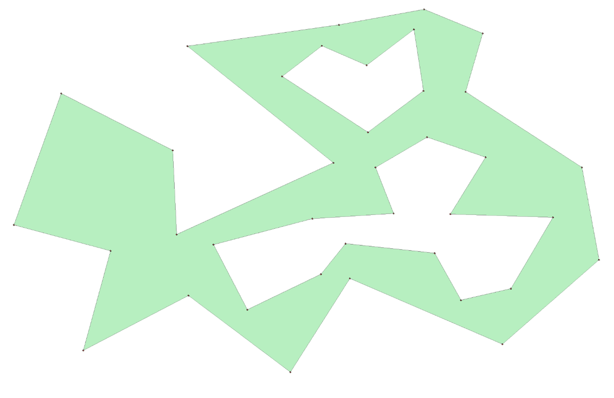

# Triangulation of polygons with holes

## Description

I developed this Python program to address a beautiful problem I encountered in a larger project involving mesh generation.  
The challenge involves a **polygon with holes**, which is a generalization of a simple polygon that includes an outer boundary and zero, one or more inner boundaries (the holes), none of which may intersect. Here's an example:

<div align="center">
  
</div>

The goal is to find a **strict triangulation** of this polygon with holes, which means decomposing the shape into triangles whose vertices are the original vertices of the polygon. Here's an example of a valid strict triangulation for the polygon shown above:

<div align="center">
  
</div>

The solution I implemented here is based on the algorithm detailed by _Raimund Seidel_ in his paper _"A Simple and Fast Incremental Randomized Algorithm for Computing Trapezoidal Decompositions and for Triangulating Polygons."_. This algorithm computes a trapezoidal decomposition of the polygon in quasi-linear time (specifically, **O(E log\* E + H log E)**, where _E_ is the number of edges, _H_ is the number of holes, and **log\*** is the iterated logarithm). Once the trapezoidal decomposition is obtained, the algorithm can compute a decomposition into monotone mountains in linear time and then triangulate each monotone mountain in linear time as well, resulting in a triangulation of any polygon with holes in **O(E log\* E + H log E)**.

My implementation also handles polygons with collinear vertices, which is particularly useful for the context in which I encountered this problem: mesh generation.

One limitation of this algorithm is that the resulting triangulation is not a **Delaunay triangulation**: While it guarantees a strict triangulation of the input polygon, it does not optimize for maximizing the minimum angle of the triangles, as Delaunay triangulations do.

To make my implementation more user-friendly, I developed a Tkinter interface that allows users to draw polygons with holes interactively and visualize the generated triangulation.

## Installation and Usage

Follow these steps to install and test the project on your computer:

1. Clone the GitHub repository:

```bash
git clone https://github.com/VivianMenard/triangulation-of-polygons-with-holes.git
```

2. Navigate to the project directory and run the main script:

```bash
cd triangulation-of-polygons-with-holes
python ./main.py
```

This project was developed using `Python 3.12.0`, but it may also work with other `Python 3` versions.
It uses `Tkinter`, which is included by default in standard Python installations. No additional dependencies are required.

3. The Tkinter interface will open:

- Left click to add vertices.
- Right click to close the polygon.
- Watch the triangulation being generated, even for complex polygons with holes!

## License

This project is licensed under the MIT License, which allows free use, modification, and distribution. For more details, see the [LICENSE](LICENCE) file.

## Bibliography

Raimund Seidel, _"A Simple and Fast Incremental Randomized Algorithm for Computing Trapezoidal Decompositions and for Triangulating Polygons"_, Computational Geometry: Theory and Applications, 1991, 1(1), 51–64.  
[DOI: 10.1016/0925-7721(91)90012-4](<https://doi.org/10.1016/0925-7721(91)90012-4>)
